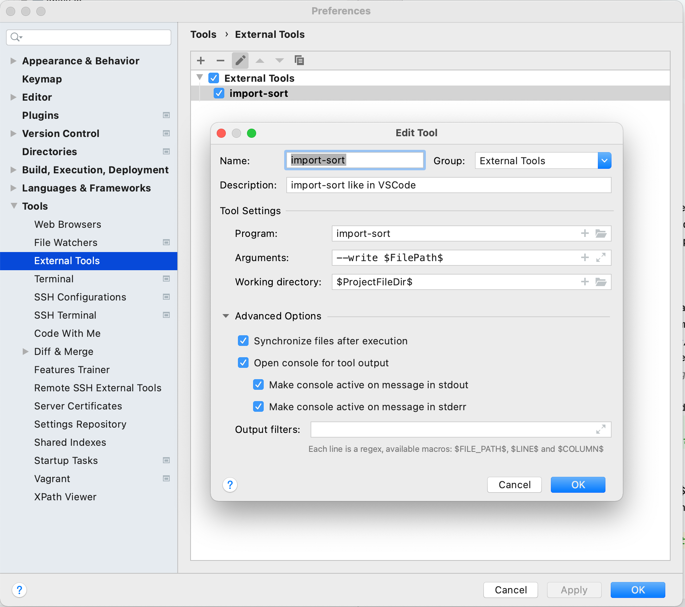

# Code Style

Most code style rules are checked by linters. Code formatting is applied via prettier. Linters and prettier run automatically triggered by pre-commit hook on all files which have staged changes. If possible, you should [configure your IDE/Editor](#running-prettier-on-save) to run prettier on all files when saving the file.

_CAUTION:_ If you use `git add --patch` to only commit a portion of a file's changes while excluding other changes in the same file from the commit by not adding them, the pre-commit hook will still add the whole file with all changes, so that won't work.

## Simon Sort

There is one style rule that is not automatically enforced or taken care of (yet): _Simon sort_. This is our rule on how to sort imports in ES6 files. We split all imports into three blocks (not all three blocks are present in each file):

1. Third party imports (React, Lodash, ...) first, then
2. Instana imports (everything from one of the packages in `ui-client/packages/`, and finally
3. CSS/LESS file imports (all `*.less` and `*.mless` files).

These blocks are separated by a new line. The first import block usually starts at the first line of the file (that is, there is nothing else above the imports).

The imports in one block are _sorted by line length, descending_. The longest import line at the top, the shortest line at the bottom.

Basically, this is our (totally arbitrary, but at least consistent) rule for sorting imports. The main reason it was chosen is that it can be verified very quickly visually without inspecting the individual imports.

Here is an example of some imports, correctly simon-sorted:

```javascript
import React from 'react';

import TreeHeader from 'in-applications/analyze/components/TraceDetails/components/CallTree/components/TreeHeader';
import { getStart, getEnd } from 'in-applications/analyze/components/TraceDetails/components/callStartAndEndTime';
import LoadingCallTree from 'in-applications/analyze/components/TraceDetails/components/CallTree/LoadingCallTree';
import Row from 'in-applications/analyze/components/TraceDetails/components/CallTree/components/Row';
import ErroneousResultPresenter from 'in-components/Errors/ErroneousResultPresenter';
import createScale from 'in-services/scale';

import locals from './CallTree.mless';

export default function CallTree({
}) {}
```

## Running Code Formatting On Save

### VS Code

Install the "Prettier - Code formatter" code extension and the `sort-imports` extension. Both of these are in our suggested extensions, i.e. VS Code should prompt you to install these once you open up the ui-client repo in VS Code.

### IntelliJ & Co

Install the  **Prettier plugin (by JetBrains)** and use these defaults:
  - Prettier package: <Project_RootDir>/node_modules/prettier
  - ✔️ Activate "run on save for files:" ({\*_/_,\*}.{js,jsx})

For **Simon Sort** there is no plugin or extension really needed, because this will formatted by import-sort the post-commit step anyway.
Just if you want to trigger _import-sort_ manually, then add this external tool entry:
  - install `import-sort` globally via `yarn global add import-sort`
  - In Preferences
    - Add a new entry like this in the `Tools/External Tools` section:
      
      - **Program** import-sort
      - **Arguments** --write $FilePath$
      - **Working directory** $ProjectFileDir$
    - set your preferred shortcut to run it on a keystroke - via keymap config

Note: Running it automatically on-save using _file watchers_ did not work reliably

### VIM

- Install https://github.com/prettier/vim-prettier
- Add the following to `~/.vimrc`:

```
" run prettier on JavaScript/CSS files when saving
let g:prettier#autoformat = 0
autocmd BufWritePre *.js,*.jsx,*.mjs,*.ts,*.tsx,*.css,*.less,*.scss,*.json,*.graphql PrettierAsync
```

# Useful hints

## Forms

We always need to suppress the default form submission behavior as the default submission behavior is to trigger a navigation event. So whenever you add an onSubmit event handler, please remember to do:

```javascript
<form onSubmit={e => {
    e.preventDefault();
    // stuff you actually want to do
  }}>
```

## Process when Implementing Websocket subscriptions

One of the first steps when considering a new WebSocket
subscription is too establish the contract. A UI or backend engineer
should start to outline this and then agree upon it. The backend implementation
could initially even be a dummy one, i.e. always send the same response. (But at least then we have established a contract will validation rules).

The UI engineer needs to take the lead here. This is nothing a UI engineer should ever wait on or list as a blocker/reason for a second PR. This also means that we never merge a UI PR making use of a subscription that is not agreed upon and that at least has a dummy implementation in the backend.

### Event IDs in Webscocket subscriptions should always start with a get like getXXX()

```javascript
export default createResultSubscriptionFactory({
  eventId: 'getReleases'
})
```

Derived from the backend:
```java
  @OnEvent("getReleases")
  public Observable<Result<PaginatedResult<ReleaseWithIdInternal>>> getReleases(GetReleasesSubscribeEvent event) {}
```

```typescript
import { createResultSubscriptionFactory } from 'in-subscription/resultSubscriptions';
import { GetReleasesQuery, Release, Result } from 'in-types';
import { Observable } from '@instana/observables';

const getReleases: (
  parameter: GetReleasesQuery
) => Observable<Result<PaginatedResult<Release>>> = createResultSubscriptionFactory<
  GetReleasesQuery,
  Result<PaginatedResult<Release>>
  >({
  eventId: 'getReleases',
  disposeSubscriptionOnDocumentHidden: false
});

export default getReleases;
```

## Always use CSS Modules for new Components

We use Less as CSS preprocessor. Every Less (CSS)-Module has the file extension .mless.
Example:

```less
/* less module file */

:local {
  .button {
    color: black;
    font-family: var(--ids-font-size-option-body-bold);
    ...;
  }
}
```

```javascript
/* React component */

import locals from './Button.mless';

function Button() {
  /// ...
  return(
    <button className={locals.button}> {children} </button>
  )
}
```

## Use global styles

We have a Less file for global styles. For example colors, borders, typography stuff, etc. Please use this variables instead defining your own values over and over again.
~Not recommended anymore: To use this variables import active.less at the top of your Less module.~

These variables injected by the theming mechanism in the background, they 
are implemented as part of the @instana/design-tokens package,

Please head over to the storybook/docs of the [/instana/ui-foundation](/instana/ui-foundation) repo:
[Page about IDS color tokens](https://pages.github.ibm.com/instana/ui-foundation/?path=/docs/design-tokens-colors-ids-tokens--docs)

Example:

```less
/* less module file */

:local {
  .button {
    font-family: var(--ids-font-family-option-sans-serif);
    ...;
  }
}
```

## Always use CSS class selectors to style child elements

Styling child elements should almost always be done with CSS class name selectors.

Bad:

```less
/* less module file */

:local {
  .container {
    ...;
    > icon {
      ...;
    }
    > button {
      ...;
    }
  }
}
```

Good:

```less
/* less module file */

:local {
  .container {
    ...;
  }
  .icon {
    ...;
  }
  .button {
    ...;
  }
}
```

## Directly export default

Directly export default. We do not assign it to a variable beforehand.
We use **named functions**, so it will show up in react dev tools with its name (compared to exporting an anonymous function or an arrow function) 

```javascript
/* Function/Class components */
export default function Button() {
  /// ...
}

/* Composed components (HOCs) */
export default compose(withFoo, withBar)(MyComponent);
```

## Omit curly brackets when passing strings to a component

Bad:

```javascript
/* React component */
function MyComponent() {
  /// ...
  return( <SvgIcon type={'lib_actions_star'} /> )
}
```

Good:

```jsx
/* React component */
function MyComponent() {
  ///...
  return (<SvgIcon type="lib_actions_star"/>)
}
```
