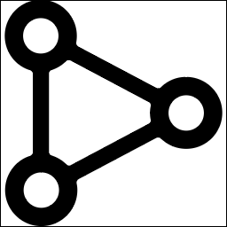

# (New) icons

The issue with the old icon was that when placing all different icons side by side, they look different in size, even if they all have the exact same pixel size. In the newer part of the product [*2], we therefore used a different approach. It would be a mess to have different padding definitions per icon in the UI, so every icon would look the same size. Therefore, we baked the paddings into the icons path itself. Meaning that some some icons don't fit perfectly into the SVG box anymore. This allows us to just use one icon size independently of which concrete icon we render and they look all the same in size. Furthermore, we don't use a pixel size of 128x128 anymore, because with the design (introduced beginning of 2018), we have a grid of times 8px everywhere (8, 16, 24, 36, 48, etc). Icons are all now created and used with a 24x24 size. An example looks like:

```javascript
<?xml version="1.0" encoding="utf-8"?>
<svg xmlns="http://www.w3.org/2000/svg" width="24" height="24" viewBox="0 0 24 24">
    <path d="M12,22A10,10,0,1,0,2,12,10,10,0,0,0,12,22Zm0-12,4,4H8Z"/>
</svg>
```


\*2 applications, websites and kubernetes views. Mostly everything which was introduces since early 2018

## How to use icons in the code

We have a registry [will all icons plus all the plugin icons](https://github.com/instana/ui-foundation/blob/main/packages/components/src/components/SvgIcon/integratedIcons.ts). Newer icons are prefixed with a "lib\_". When you want to use an icon, you can simply write:

```javascript
<SvgIcon type="lib_arrow_drop_up" width={24} height={24} />
```

The `<SvgIcon />` component has several other properties, most of them are only used in the old part of the product, or to define custom styles and classNames.

## How to create a new icons

Usually, the design team is responsible to provide new icons in the new (24x24 with baked padding) style. When they send a new icon file (usually xyz.svg), you need to make extract the path from the files content. Just open the .svg file in an editor and copy out the `d="..."` path. Then you create a new entry in the [icon registry within the ui-foundation repository](https://github.com/instana/ui-foundation/blob/main/packages/components/src/components/SvgIcon/integratedIcons.ts):

```javascript
lib_my_new_awesome_icon: {
  path: 'The path you copied from the .svg-file';
}
```

Please open a pull request with the new icon and ping the UI community within `#tech-ui-dev` to get this change merged and released.

# (Old) Infrastructure icons

In the older parts of the product [*1], we have icons given in 128x128 pixels and without any paddings inside the icons. In other words, the icon fits perfectly with either side (or both if it's a square one) into the 128x128 view box of the SVG. An example looks like:

```javascript
<?xml version="1.0" encoding="utf-8"?>
<svg xmlns="http://www.w3.org/2000/svg" width="128" height="128" viewBox="0 0 128 128">
    <path d="M105.2,43.5c-5.6-0.1-10.6,2.1-14.3,5.7c-0.8,0.8-1.9,0.9-2.9,0.4L44.2,26.4c-0.9-0.5-1.5-1.5-1.3-2.6c0.2-1.2,0.3-2.4,0.3-3.6c0-11.3-9.3-20.5-20.7-20.2C11.5,0.2,2.7,9.4,2.8,20.4c0.1,9,6,16.6,14.2,19.1c1,0.3,1.7,1.3,1.7,2.4v43.7c0,1.1-0.7,2-1.7,2.4C9,90.5,3.1,98.1,3,107c-0.1,11,8.8,20.1,19.8,20.4c11.4,0.3,20.7-8.9,20.7-20.2c0-1.3-0.1-2.5-0.4-3.7c-0.2-1.1,0.3-2.1,1.3-2.7L88,77.7c1-0.5,2.1-0.3,2.9,0.4c3.6,3.5,8.6,5.7,14.1,5.7c11.3,0,20.5-9.3,20.2-20.7C125,52.4,116.1,43.6,105.2,43.5L105.2,43.5z M12.9,20.2c0-5.6,4.5-10.1,10.1-10.1s10.1,4.5,10.1,10.1S28.6,30.3,23,30.3S12.9,25.8,12.9,20.2z M23.3,117.3c-5.6,0-10.1-4.5-10.1-10.1c0-5.6,4.5-10.1,10.1-10.1s10.1,4.5,10.1,10.1C33.4,112.8,28.9,117.3,23.3,117.3z M84,69.8L40,93.2c-0.8,0.5-1.9,0.3-2.6-0.4c-2.3-2.3-5.2-4-8.3-5c-0.9-0.3-1.6-1.1-1.6-2.1V41.5c0-1,0.6-1.8,1.5-2.1c3.1-1,5.9-2.7,8.2-5c0.7-0.7,1.7-0.8,2.6-0.4L84,57.5c0.9,0.5,1.3,1.4,1.1,2.4c-0.3,1.2-0.4,2.5-0.4,3.8c0,1.3,0.1,2.6,0.4,3.8C85.3,68.4,84.8,69.4,84,69.8L84,69.8z M105,73.8c-5.6,0-10.1-4.5-10.1-10.1s4.5-10.1,10.1-10.1c5.6,0,10.1,4.5,10.1,10.1S110.6,73.8,105,73.8z"/>
</svg>
```



\*1 events view, infrastructure map/table, sidebar, infrastructure dashboards, hierarchical links, etc, so basically everywhere where we calculate the icon via a given plugin (through this registry: [https://github.com/instana/ui-client/blob/develop/packages/in-sdk/iconRegistry.js](https://github.com/instana/ui-client/blob/develop/packages/in-sdk/iconRegistry.js)), plus all icons inside the icon registry (packages/in-components/SvgIcon/registry.js) without a "lib\_" prefix.
