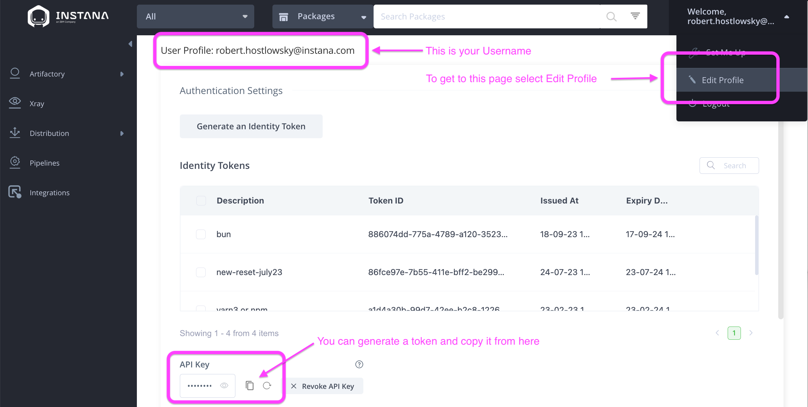
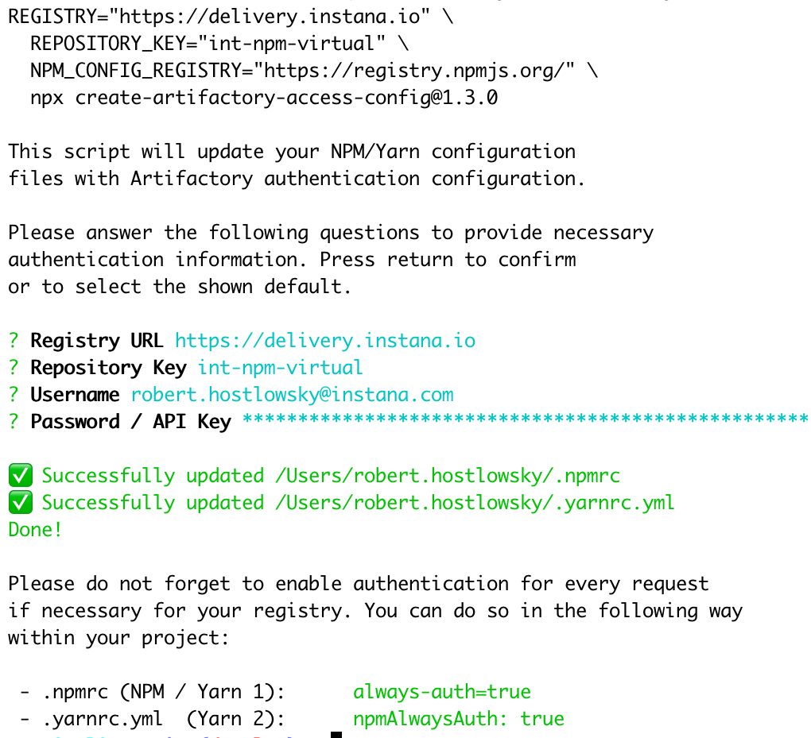
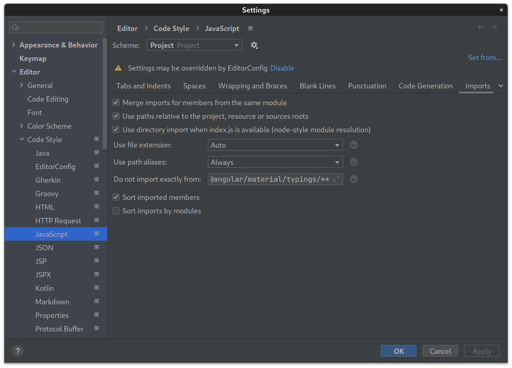

# Installation

**Please make sure you are on the develop branch to read the latest instructions.  Do not skip any of these steps, only use `sudo` where this document instructs you to and do not try to follow this guide with a super-user (root)!**

This document lists the technical steps necessary in order to get a local UI development setup running.


## Cloning the Repository

```sh
git clone git@github.ibm.com:instana/ui-client.git
cd ui-client
```
The path to the directory must not contain any spaces. Whitespaces aren't escaped when the nginx configuration is generated and this will cause nginx to not start making the development server inaccessible.

## Setting up local domains

In order for cookies to be send to the backend you need to configure rules in `/etc/hosts` to route all traffic for `local-instana.instana.io` and others to `127.0.0.1`. Only access the local development environment using one of these domains!

```sh
sudo sh -c 'echo "127.0.0.1 local-instana.instana.io" >> /etc/hosts'
sudo sh -c 'echo "127.0.0.1 local-instana.instana.rocks" >> /etc/hosts'
sudo sh -c 'echo "127.0.0.1 local-instana.pink.instana.rocks" >> /etc/hosts'
sudo sh -c 'echo "127.0.0.1 local-instana.instanatest.rocks" >> /etc/hosts'
```

## Installation of Node.js and Yarn

You need to have Node.js installed in order to execute the build, tests and the development mode. OS X and Linux users should install Node.js via the [Node Version Manager](https://github.com/nvm-sh/nvm) (NVM). NVM makes it easy to switch between installed Node.js versions and allows installation of global modules without super-user privileges.

Make sure that you have Git and cURL installed before starting with the following instructions.

Execute these instructions in the _root directory_ of the `ui-client` project:

```sh
# Ensure that you have build and compiler tools available on your system:
# For Ubuntu users:
sudo apt-get install build-essential
# For MacOS users:
xcode-select --install

# Download and install NVM
# See https://github.com/nvm-sh/nvm#installing-and-updating

# Use and install our preferred Node.js version
nvm install
nvm use

# For Ubuntu users, install Yarn:
nvm install node
sudo apt remove cmdtest
sudo apt remove yarn
curl -sS https://dl.yarnpkg.com/debian/pubkey.gpg | sudo apt-key add -
echo "deb https://dl.yarnpkg.com/debian/ stable main" | sudo tee /etc/apt/sources.list.d/yarn.list
sudo apt update && sudo apt install --no-install-recommends yarn
yarn --version
```

## Configure Access to our Artifact Registry

We are using a custom artifact registry instead of the public [npmjs.com](https://www.npmjs.com/) /
[yarnpkg.com](https://yarnpkg.com/) registries. You will need to configure your system for access before you can
continue to download our project dependencies.

You will need an account for our [delivery.instana.io](https://delivery.instana.io) Artifactory instance.

 - Instana employees should follow the [employee onboarding guide](https://www.notion.so/instana/New-Engineering-Hire-Survival-Guide-5f4be1878333477b8d6f07739a0e259b#e18b6bf976c04bdca3f6d36de6aa209c) to gain access.
 - Others, e.g., contributors from IBM, should request access via a **Instana Slack workspace** channel they have access to. We will not grant access based on private messages.

Please follow either approach and come back here once you have access.
Then execute the following snippet on your terminal.
* You can accept the proposed defaults for the first two questions.
* Answer the third and fourth question with your Artifactory credentials:
  * After log-in (use SAML-based sign-in) and
    opening the Edit-Me page https://delivery.instana.io/ui/user_profile
  * Username should have `ibm.com` suffix
  * password is just use your API token
  * 

With this information, please run this in a shell:

```sh
REGISTRY="https://delivery.instana.io" \
  REPOSITORY_KEY="int-npm-virtual" \
  NPM_CONFIG_REGISTRY="https://registry.npmjs.org/" \
  npx create-artifactory-access-config@1.3.0
```

It will look like this:
* 


## Install Project Dependencies

Now that you have access to our artifact registry, it is time to download all our project dependencies! :)

```sh
./build/upgrade-nodejs
```

OR

```sh
yarn
```

You may encounter an Artifactory error 403 Forbidden. This could be due to outdated credentials stored in your home directory in the .npmrc and .yarnrc.yml files. To resolve the Artifactory 403 error, navigate to your home directory and delete all .npmrc and .yarnrc.yml files. Then again execute the Configure Access to our Artifact Registry steps.

## Installation of Nginx

You will also need to have Nginx installed and its CLI on the path. Installation instructions can be found in the [proxrox repository](https://github.com/bripkens/proxrox/blob/master/INSTALLATION.md#installation-of-nginx).

As an alternative (especially for Linux), you might use the `nginx` script as provided in the [internal-tools repository](https://github.ibm.com/instana/internal-tools/tree/master/proxrox-nginx), which will run Nginx as Docker container. **For regular/repeated UI development however we do not recommend this option.**

On Linux, it might be required to do the following to allow `yarn` to run the ngnix-docker container without sudo:

```
sudo groupadd docker
sudo gpasswd -a $USER docker
newgrp docker
```

## Editor Recommendations

At the time of writing UI engineers are using [VS Code](https://code.visualstudio.com/) or [IntelliJ](https://www.jetbrains.com/idea/). We would recommend that you use either of them. VS Code will bring up a list of suggested extensions when opening the `ui-client` root directory in VS Code. We recommend that you install these as well for a good out of the box development experience.
In Intellij make sure
* [x] Use paths relative to the project is selected.
Or it will import using relative paths (with `../../` etc.)


## Note for WSL2 Users

The installation instructions will work out of the box, assuming that you are using an Ubuntu installation for your WSL2. If you intend to use a Windows based browser, you will also need to add the relevant entries to the Windows hosts file (`c:\Windows\System32\Drivers\etc\hosts`):

```
127.0.0.1 local-instana.instana.io
127.0.0.1 local-instana.instana.rocks
127.0.0.1 local-instana.pink.instana.rocks
```

Alternatively, you can install an XServer in your Windows environment and run your preferred browser from within WSL2.

There is some advanced WSL2 Support int the latest IntelliJ Version 2022.3 [more details](https://www.jetbrains.com/help/idea/how-to-use-wsl-development-environment-in-product.html)

## Next Steps

Head over to the [local development guidelines](./LOCAL_DEVELOPMENT_GUIDELINES.md) to learn how to execute tests and how to execute the development mode.
