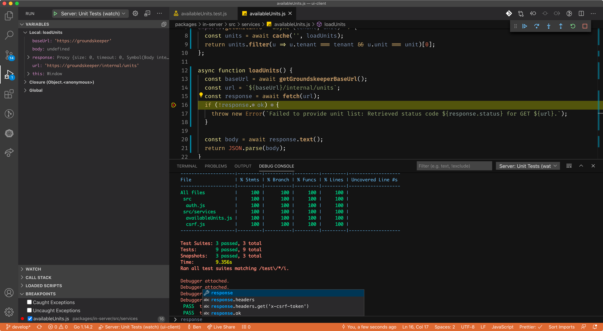

# Local Development Guidelines

**Make sure that you have followed the [installation guidelines](./INSTALLATION.md) before continuing.**

## Executing tasks

Tasks are defined in the `package.json`. They can be executed via `yarn run <taskname>`.

 - `yarn run dev`: Starts the development mode. This is what you want most of the time. The development mode will ask you several questions during startup. When you are just starting out you should always select the default options, i.e. always hit `return` to accept the defaults.
 - `yarn run storybook`: Starts up our storybook/component catalog locally.
 - `yarn run test`: Executes the test suite and lints the whole source code.
 - `yarn run test:unit:watch`: Re-executes the whole test suite on file change. Most of the time this is too slow for a good TDD flow. You may want to temporarily adapt the file watch configuration from `packages/**/*_test.js` to, e.g., `packages/in-foobar/my_test.js`, to only re-execute a specific test or the tests in a specific sub-directory.
 - `yarn run build`: Builds the whole source code. This is not required for most local development workflows. *You probably don't need this.*
 - `yarn run try-build`: Can be executed after a successful `yarn run build` to start up the UI in a way that is similar to production deployments. The UI will expect that backend components are available locally using their default development ports, e.g. the ports opened via our tunnel script. *You probably don't need this.*
 - `yarn run check:licenses`: Generates a `ui-client-license-report.csv` and a `ui-server-license-report.csv` in the repository root which comes in handy when we need to validate licenses of our dependencies, e.g., for a technical due dilligence. *You probably don't need this.*

## End to End Tests

We do have end to end tests for the Instana user interface. We started maintaining these within the [backend repository](https://github.com/instana/backend/tree/develop/e2e-tests/ui#readme). This was done in preparation for an eventual merge of the backend and UI repositories into a real *product* repository.

## Visual Studio Code Integration

We provide ready-made launch configurations for Visual Studio Code users (in `.vscode/launch.json`) that you can leverage for better development experiences. You can leverage these to start the client/browser unit tests and the server unit tests from the' Run' menu. Thanks to VS Code's great out-of-the-box integration, you can also set breakpoints to debug your JavaScript -or- to enter a test-driven-development flow.



## Advanced

**Are you just starting out with local UI development? If so, skip this section for now and consider returning at a later time.**

### The Node.js Front End Server

During development you will mostly work with `yarn run dev`, but in production the assets are served by a small Node.js app which you can find in `packages/in-server`. This component also makes a few preliminary requests, for example to `/checkUserAccessPermitted`, `/api/ui/settings`, `/api/search/fields` and a few more. The results of some of these requests will be injected into the Handlebars template for index.html (`packages/in-server/templates/index.hbs`, which is also only used in production while `packages/in-client/index.html` is used during development).

It is rather rare, but if need to start `in-server` locally, here's how:

_Note: you need to start the tunnel script. `backend/dev/scripts/tunnel.sh`_

- `yarn run build`
- `yarn run try-build` can also be used after the first successful Gulp/Webpack build

If the build fails while trying to start the Proxy (Proxrox) with something like:

```
error, no objects specified in config file,
```

This might be due to an incompatibility between Proxrox and MacOS' default openssl executable. Check `openssl version`, if it says something like `LibreSsl 2.xx`, consider doing `brew install openssl`/`brew upgrade openssl` and (important!) adding its path to your shell's init scripts (`export PATH="/usr/local/opt/openssl/bin:$PATH"`). After that, `openssl version` should say something like `OpenSSL 1.0.2o 27 Mar 2018`.

### Preferences/Environment Variables

A few environment variables are used to tweak the UI development workflow to your personal preferences. These are used for `yarn run dev`:

- `TARGET`:
  - If this is set to `test` (non case-sensitive) the UI client will connect to the test environment automatically instead of asking you for the target environment.
  - If this is set to `local` (non case-sensitive) the UI client will connect to your local back end instead of asking.
  - Otherwise, `yarn run dev` will ask for the target environment during startup.
- `BUILD_MODE`:
  - If this is set to `prod` (non case-sensitive), sources will be compiled in production mode.
  - If this is set to `ask` (non case-sensitive), you will be asked and can choose between production mode or development mode.
  - Otherwise, sources will be compiled in development mode.
- `HOT_RELOAD`: If this is set to a non-empty string and the build is running in development mode, the build will trigger a browser reload automatically when a file is changed and saved and the project has been recompiled. Without this, you'll have to refresh manually.
- `DONT_OPEN_BROWSER`: If this is set to a non-empty string, the UI build will not open a new browser window when the build is finished.

For maximum convenience, you can create aliases like this for your shell:

```
alias uit="cd /Users/name/path/to/ui-client && TARGET=test yarn run dev"
alias uil="cd /Users/name/path/to/ui-client && TARGET=local yarn run dev"
```
