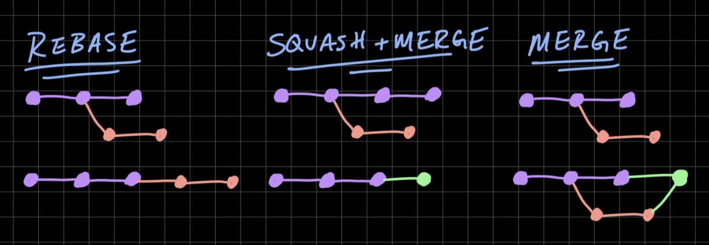
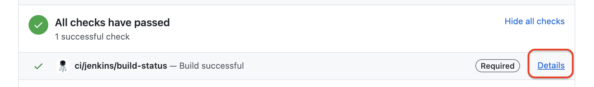

# Pull Request Workflow

## How to create a PR and what information to include

### Make a Clear Description

PR’s description gives the reviewer initial context on the task. Include the following:

* Add "**Why**" section to explain briefly about your task.
* Add "**What**" section to explain what exactly you changed to address your task.
* A link to the ticket (such as `Kanban Card`/`Zendesk Ticket`).
* Links to related pull requests (for example, related changes in the backend).
* Screenshots(if applicable) comparing the previous version with the version after your change.

If you think some information is required to understand the code — don’t put it into PR’s description. Instead, make a code comment: they’re more prominent and will help future readers.

#### Comment Your Own Pull Request

Consider commenting your own pull request to give additional context to reviewers if needed.

#### Applying labels to your PR

It's very important that you mark the PR with correct set of label(s) so the person reviewing this knows the current state of your PR.

* **Needs Discussion** - Indicates that you would like to discuss your approach with others regarding the change you introduced
* **WIP** - Indicates that you are still working on your PR (or it's better to prefer [a draft PR](https://docs.github.com/en/pull-requests/collaborating-with-pull-requests/proposing-changes-to-your-work-with-pull-requests/changing-the-stage-of-a-pull-request#converting-a-pull-request-to-a-draft) over making it `WIP`)
* **Review** - Indicates that you need a review for your change
* **Review + Merge** - Indicates that you want to get it reviewed and if the given changes are approved, reviewer could also merge your PR
* **Docs** - Indicates that you added/improved the documentation
* **Internal-Feature** - Indicates that the change introduced does not affect our customer but rather helpful internally (e.g. for product or engineers)
* **Release Hotfix** - Indicates that you are targeting this change to a release branch on which you would like to apply your fix. This is helpful when you are working on a ticket to fix the production issue and would likely request a hotfix deployment.
* **Do Not Merge** - Indicates explicitly that you don't want someone to merge this PR yet! (or alternatively you could [convert it to a draft](https://docs.github.com/en/pull-requests/collaborating-with-pull-requests/proposing-changes-to-your-work-with-pull-requests/changing-the-stage-of-a-pull-request#converting-a-pull-request-to-a-draft))
* **Waiting For Design** - Indicates that you are still waiting for the design input from PXD (Product Designer) 

### Nice to have PR practices

#### Benefits of writing small PR

* Reviewed more quickly
* Less likely to introduce bugs
* Less wasted work if they are rejected
* Easier to design & merge
* Less blocking on reviews
* Simpler to roll back

Before writing a large PR, consider whether preceding it with a refactoring-only PR could pave the way for a cleaner implementation. Talk to your teammates and see if anybody has thoughts on how to implement the functionality in small PRs instead.

#### Separate Out Refactorings

* It’s usually best to do refactorings in a separate PR from feature changes or bug fixes.
  * For example, moving and renaming a file could be in a different PR from fixing a bug in that file. It is much easier for reviewers to understand the changes introduced by each PR when they are separate.

#### Rebase Onto fresh Master (such as `develop` or `release-<num>`) before Creating a PR

It’s usually a good idea to clean up your code with an interactive rebase before submitting your pull request.

There are several benefits to this:
- Tests might pass in your local branch, but fail with the latest updates applied.
- You would be able to use recently added functionality

We favour **rebase** over **merge** because with rebase the branch contains only relevant commits.

#### What is difference between different merging strategy (Squash, Merge, and Rebase)?

1) **Rebase**: This moves the entire feature branch to begin on the tip of the remote base branch, effectively incorporating all the new commits in base branch.

2) **Squash + Merge**: Retains the changes but omits the individual commits from history.

3) **Merge**: Retains all the commits in your branch and interleaves them with commits on the base branch.

**NOTE**: It is very useful when we are working on a feature branch, and we have done so many commits for a single feature. As there are many commits which are not even useful for the master(or remote base branch) so the better way is to squash them into the single commit and that commit will be merged in the base branch.

**Things to keep in mind when migrating JS file to TS file**: Please refer to extensive documentation for the [TS migration process](https://www.notion.so/instana/Typescript-Migration-b4b79667e5c64c01a10cb3090ff7b043#230e977e603e429581fda71d5fbe6b40)

## Code Ownership & Code Reviews

### How to extend code ownership?

1) If you are adding new code in a package that is not currently listed in [CODEOWNERS](./.github/CODEOWNERS) file then make sure to add a new entry so the review would be requested from the correct team.
2) In case you are adding a code in a package that has shared ownership, please make sure to adjust the [CODEOWNERS](./.github/CODEOWNERS) file.

### Code Review Best Practices

* Give Respectful and Constructive Code Review Feedback that **Helps** (not **Hurts**). Try to use [conventional comments](https://conventionalcomments.org/).
  * To make sure that you have a good understanding of what the code is for, try clarifying things with your fellow developer.
  * It’s important to go into reviews knowing what to look for in a code review.
    * Such as Structure, Style, Logic, Performance, Design, Readability (and maintainability), and Functionality.
  * The tone of code reviews can greatly influence morale within teams. A professional and positive tone can contribute healthy and lively discussions.
* Try not to review for longer than 60 minutes at a time. Performance and attention-to-detail tend to drop off after that point. It’s best to conduct code reviews in short sessions.

### How to address review feedback?

* Try to clarify things for any questions or suggestions.
  * If you can’t answer the question, ask the reviewer for clarification.
  * If you disagree with the reviewer, find ways to collaborate: ask for clarifications, discuss pros/cons, and provide explanations of why your method of doing things is better for the codebase.
  * Sometimes, you might know something about the codebase that the reviewer does not know. Engage your reviewer in discussion, including giving them more context.
* Don't take review personally. The goal of review is to maintain the quality of our codebase and our products. When a reviewer provides a critique of your code, think of it as their attempt to help you and the codebase.

### Where to request a review if you have modified shared code?

In case you have modified the shared code which has to be reviewed by the respective team, then post your PR to their respective Brewery Slack channel. If you are not part of the channel then ask in `#tech-dev` to be added to the channel.

If your PR requires `eng-ui` approval then post your PR in `#tech-ui-dev` Slack channel.

### When and how can a PR be merged?

As soon as GitHub shows that your PR has all the required approvals. Please refer to merging strategies explained above.

- Nitpicks and Suggestions are usually optional. Feel free to address them. But that should not block you from merging the PR.
- If a comment starts with **Issue** but is not accompanied by a `Request Changes` review, then the comment should still be addressed. However, if the status of the PR is unclear a quick question to `#tech-ui-dev` should help clear things up.

#### How to check build failures on Jenkins?

It should be easier to find any specific issue when using the links from the "checks section" of your PR.

Alternatively you could find [your PR build under ui-client in Jenkins](https://dev-jenkins.instana.club/job/ui-client/).

#### How to get access to Jenkins?

Access Management at Instana works through AccessHub. See [how to request access](https://instana.slack.com/archives/C03HLTQUZK7/p1654108908538479).
