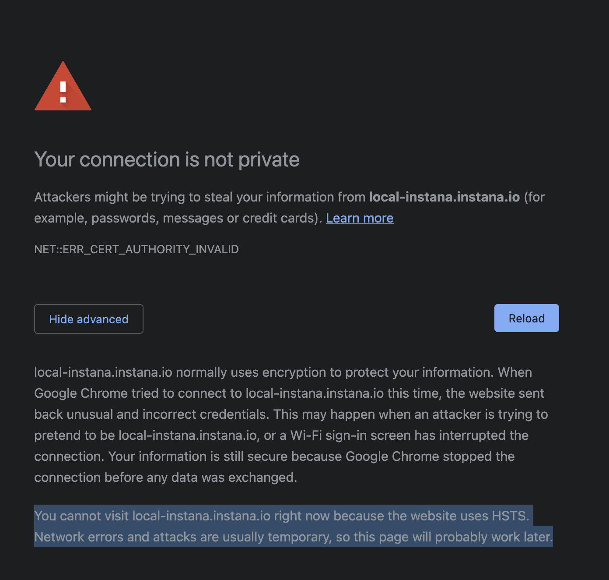

# Troubleshooting

## Something is broken and I don't know what is going on

First ensure that you followed all steps outlined in our [installation guidelines](./INSTALLATION.md). Next execute the following script to attempt to fix the local development environment.

```bash
./build/upgrade-nodejs
```

Everything fine now? Great! Still borked? Ping `#tech-ui-dev` on Slack with the full command line output!

We found issues caused by
* some local changes or additions, e.g. a modified .npmrc file. Run `git status`
* additional or duplicate entries in the `.npmrc` file in your home folder. It should ideally only contain one entry like
  ```
  //delivery.instana.io/artifactory/api/npm/int-npm-virtual/:_auth..<SECRET>.
  ```
* Yarn Cache: If most dependencies can be loaded, but only _some latest new_ dependencies cannot, this indicates, that the authentication-key for artifactory is not correct.
* Spaces in the path to the project directory, these will break the nginx config so be sure that there aren't any


## The Pre-Commit Hook Will Not Let Me Commit

Please do not use `--no-verify` or `-n` to commit. In a lot of cases, this will create issues for other developers (broken Jenkins build, other people cannot commit due to issues introduced by your unchecked commit).

1. If the error message indicates a linting problem or a unit test issue, fix that issue. If you do not know how to fix it, ask for help in #tech-ui-dev.
1. If there is a different error, you might check/try three other things:
   1. Has the Node.js version for the repo `ui-client` been changed recently (since you last committed something without issues)? Check `git log .nvmrc` to find out. Refer to the section [Upgrading Node.js](#upgrading-nodejs) for details on how to switch to the new Node.js version.
   1. Are you using a different Node.js version than the `ui-client` repo? Check the output of `node --version` versus the content of `ui-client/.nvmrc`. You can execute `nvm use` (in the `ui-client` directory) to switch to the correct version.
   1. Execute `yarn` in the `ui-client` directory, without any arguments. This helps when new dependencies have been added that have not been installed to your local `node_modules` folder. It is safe to do this even when your `node_modules` are up to date.

## Problem with pngquant on Ubuntu?

In case you are using e.g. Ubuntu and installing `pngquant` is making troubles like `npm ERR! Failed at the pngquant-bin@4.0.0 postinstall script.`, try to do the following:

1. Ensure libpng-dev is installed:

```
$ apt-get install libpng-dev`
```

2. On Ubuntu, you even might need to install `libpng12`:

```
$ wget -q -O /tmp/libpng12.deb http://mirrors.kernel.org/ubuntu/pool/main/libp/libpng/libpng12-0_1.2.54-1ubuntu1_amd64.deb \
    && sudo dpkg -i /tmp/libpng12.deb \
    && rm /tmp/libpng12.deb
```

## I cannot access the local development domain due to HSTS!



Upon your first visit to any SAAS/production `*.instana.io` URL, an [HSTS](https://en.wikipedia.org/wiki/HTTP_Strict_Transport_Security) instruction gets persisted in your web browser. This causes web browsers to reject all self-signed certificates when an HSTS instruction is available. We are working on a more permanent improvement for the local development workflow. Until then you have to do the following:

- Chromium based web browsers (Chrome, Edge and others): Type in `thisisunsafe` on the screen mentioning the security issue (there is no input, just click into the page and start typing). Alternatively, remove the HSTS instruction via [chrome://net-internals/#hsts](chrome://net-internals/#hsts). Type in the domain `instana.io` within the `Delete domain security policies` section and hit the delete button.
- Firefox: Open the file called `SiteSecurityServiceState.txt` and remove the line for the domain `instana.io`. On MacOS, this file is located within the `~/Library/Application Support/Firefox` directory.

**Note:** We temporarily had HSTS enabled for our development environments (`*.rocks`). While we no longer instruct web browsers to persist a HSTS configuration, your web browser may still have the previous instruction persisted.

## Instana dev extensions are saying that no stores could be found

This most likely occurs due to stores which contain cyclic object structures and therefore cannot be JSON serialized. To find out which store is breaking the dev extensions, run the following JavaScript snippet in the developer console.

```javascript
Object.keys(instana.dev.storeStates).forEach(key => {
  try {
    JSON.stringify(instana.dev.storeStates[key]);
  } catch (e) {
    console.error('Store "%s" cannot be JSON serialized', key);
  }
});
```

## Connecting local UI client to Remote, Self-Hosted installation (Fyre)


Here are some additional setup and troubleshooting steps for hooking up a locally-run UI client to a remote installation, such as a tenant unit hosted on IBM Fyre systems.

This example is written given a backend that's been deployed to `instana.apps.leaps.cp.fyre.ibm.com`. Tenants are a logical grouping of 1 or more units with shared processing components. If a tenant is registered with the name `tenant0` and contains the unit `unit0`, then a k8s-hosted remote UI backend will likely be in the format `unit0-tenant0.instana.apps.leaps.cp.fyre.ibm.com`.
For on-prem and single unit docker envs, this format may not be used, so confirm that you have the correct unit and tenant names with the env owner.

To connect a local ui-client you will need to prefix `local-instana` to the tenant units URL like this: `local-instana.unit0-tenant0.instana.apps.clusername.cp.fyre.ibm.com`.

### Setup

- Add the following to your `/etc/hosts` file:
```
 9.XX.XXX.XXX instana.apps.leaps.cp.fyre.ibm.com
 127.0.0.1 local-instana.unit0-tenant0.instana.apps.clusername.cp.fyre.ibm.com
```
  - Note that the first entry may not be needed if you have configured your DNS resolver to go through the fyre nameservers `9.0.0.1` and `9.0.0.2` (at time of writing).
  - You can get the IP address of a fyre server with `ping -c 1 xyz.fyre.ibm.com`, even if the packet is not received.

- Once you're able to `yarn run dev` and see the prompt asking `Environment?`, select the `Custom Self Hosted (run local UI against an arbitrary remote self hosted installation)` option. Fill out:
  - Hostname? `unit0-tenant0.instana.apps.leaps.cp.fyre.ibm.com`
  - Tenant? `tenant0`
  - Unit? `unit0`

- After a minute, a window should open in your browser for `https://local-instana.unit0-tenant0.instana.apps.leaps.cp.fyre.ibm.com:4000/`, terminal output should clear, and it should display that same url and that everything is ok (No issues found.)...(or not).

### Troubleshooting:

- may need to refresh locally-run page after it initially opens, once the terminal says `Compiled Successfully!`
- if a page is blank and gives a randomly generated error code, you probably have an issue in whatever you added to the `ui-client` code
- make sure nginx is started
- make sure hosts file has appropriate entries
- if locally-run UI page isn't working, refresh the webpage you have with the remote UI for unit0-tenant0 (or whatever tenant you're connecting to), then try again. Make sure you're logged in there.


## Connecting local UI client to Heliconia environment

Similar to the above case where you are connecting your locally built ui to a remote self hosted fyre environment, you can connect to the new Heliconia environment backend (eventual pink replacement).

- Add an local-instana entry with the base domain for heliconia to your `/etc/hosts` file if it is not already there :
```sh
sudo sh -c 'echo "127.0.0.1 local-instana.instanatest.rocks" >> /etc/hosts'
```

- Once you're able to `yarn run dev` and see the prompt asking `Environment?`, select the `Custom SaaS (run local UI against an arbitrary tenant unit in one of our SaaS or internal regions)` option. Fill out:
  - Base Domain? `instanatest.rocks`
  - Tenant? `tenant1`
  - Unit? `unit1`
- Alternatively, you can select in the `Environment?` question the environment `K8s Test (heliconia)` or run `TARGET=heliconia yarn run dev` as a short cut.
- After a minute, a window should open in your browser for `https://local-instana.instanatest.rocks:4000/`, terminal output should clear, and it should display that same url and that everything is ok (No issues found.)...(or not).

## Having trouble to access Pink UI
In rare cases, it can happen that the Ooops page is displayed because something is wrong with the current session information or the auth redirect. In these cases, the following two tips can still help you to log in and bypass the Ooops page:
1. Sign in directly via https://test-instana.pink.instana.rocks/auth/signIn?returnUrl=https://test-instana.pink.instana.rocks/.
2. Run TARGET=test yarn dev in ui-client, which should bring up https://local-instana.pink.instana.rocks:4000/#/home (or you can open it manually). Use the Pink UI username and password to log in. Then in the same browser window, open https://test-instana.pink.instana.rocks/.
